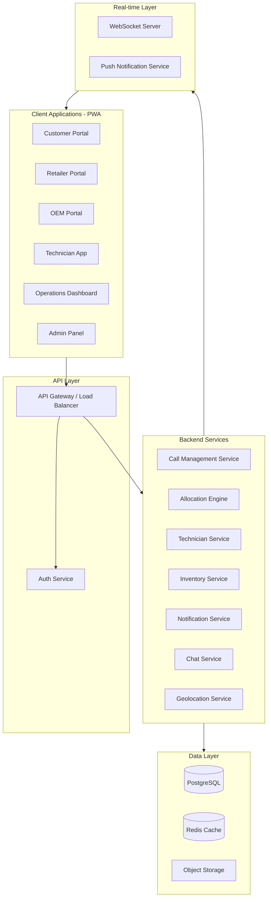
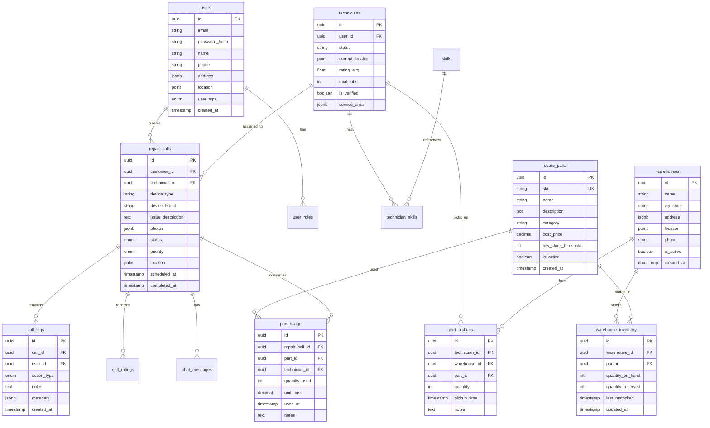
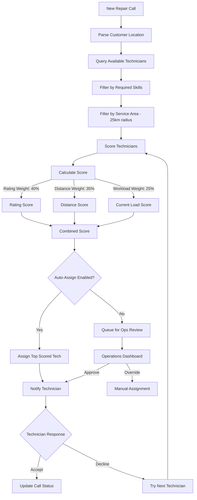
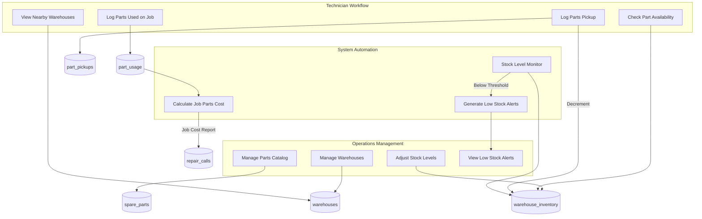
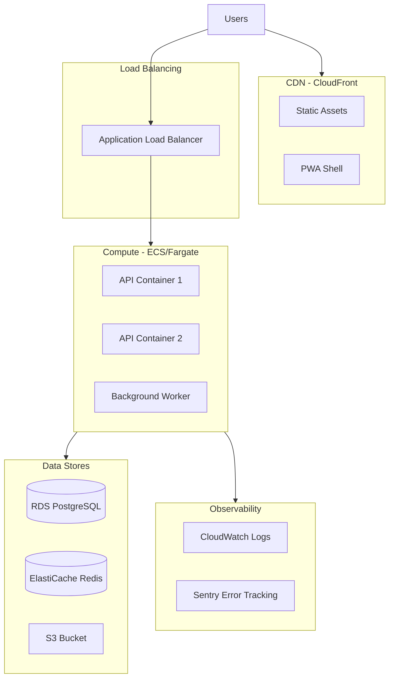

# 🔧 Electronics Repair Platform (EIPlatform)

> The purpose of this document is to serve as a proposal of how to develop a scalable electronics repair platform connecting customers, retailers, and OEMs with technicians through an operations-managed workflow.

[](https://www.typescriptlang.org/)
[](https://reactjs.org/)
[](https://nodejs.org/)
[](https://www.postgresql.org/)

## 📋 Table of Contents

- [Overview](#overview)
- [How to use Cursor](#how-to-use-cursor)
- [Team Collaboration & Development Process](#team-collaboration--development-process)
- [Development Roadmap](#development-roadmap)
  - [System Architecture](#system-architecture-overview)
  - [Tech Stack](#tech-stack)
  - [Phase 1: MVP (Weeks 1-6)](#phase-1-mvp-weeks-1-6---core-platform)
  - [Phase 2: Enhanced Features (Weeks 7-10)](#phase-2-enhanced-features-weeks-7-10)
  - [Phase 3: Scale and Optimize (Weeks 11-14)](#phase-3-scale-and-optimize-weeks-11-14)
- [Database Schema](#database-schema-design)
- [API Documentation](#api-documentation)
- [Quality Assurance](#quality-assurance-strategy)
- [Deployment](#deployment-architecture)

## 🎯 Overview

Build a scalable electronics repair platform connecting customers, retailers, and OEMs with technicians while managing billing and parts inventory, through an operations-managed workflow. The MVP delivers core call logging, auto-allocation with override, billing, parts inventory and real-time tracking in 4-6 weeks using React, Node.js, TypeScript, and PostgreSQL as a PWA.

This plan and the mockup pages have been built using Cursor + Opus, Gemini, Grok... This has greatly reduced time to test and improves developer output exponentially. 

### How to use Cursor

#### 🗨️ Ask Mode (Chat)
**Best for:** Questions, explanations, and code exploration without making changes.
- Get explanations of how code works or ask "what does this do?".
- Explore the codebase semantically.
- Review code and get suggestions before implementation.

#### 🤖 Agent Mode
**Best for:** Implementing features, fixing bugs, and making multi-file changes.
- Creates, edits, and deletes files directly across the workspace.
- Runs terminal commands and installs dependencies.
- Handles complex refactoring and coordinated logic updates.

#### 📋 Plan Mode (Strategic Workflow)
**Best for:** Mapping out complex features and tracking implementation progress.
- Ask Cursor to "**Create a implementation plan in a new TODO.md file**" for a feature.
- Use the generated Markdown file as a roadmap with checkboxes to track your status.
- Reference the plan file using `@TODO.md` when moving into Agent mode to ensure the AI follows the steps correctly.

#### 🐛 Debug Mode
**Best for:** Identifying and resolving runtime errors, crashes, or logical bugs.
- **Terminal Integration:** Click "Fix with AI" on terminal errors to instantly analyze the stack trace.
- **Error Analysis:** Paste logs into Chat and ask "Why is this failing?" to get root-cause analysis.
- **Bug Hunter:** Ask Cursor to "Look for potential edge cases or bugs in this file" to proactively find issues.

#### ✏️ Edit Mode (Inline Ctrl+K)
**Best for:** Quick, targeted edits to selected code.
- Highlight code and describe the change (e.g., "add error handling").
- See a live diff preview before accepting changes.

---

#### 💡 Workflow Recommendations

| Task | Recommended Mode |
|------|------------------|
| "Explain this complex auth logic" | **Ask** |
| "Plan the database migration and create a TODO list" | **Plan (via Ask)** |
| "Build the user profile feature based on @TODO.md" | **Agent** |
| "Fix the 500 error showing in my terminal" | **Debug / Fix with AI** |
| "Rename this function and its imports" | **Edit or Agent** |

**Pro Tip:** Always start with **Plan Mode** for large features. Having a `plan.md` file in your workspace helps both you and the Cursor Agent stay aligned on the end goal.

---

## 🚀 Team Collaboration & Development Process

This project follows a structured but flexible, test-driven approach designed for remote development teams. Our goal is to maintain high code quality and business alignment through short, iterative cycles.

### 🏗️ Architecture & Design
The solution is built on a **microservice and task-based architecture**. This allows features to be isolated, developed, and tested independently, reducing deployment risks and improving scalability.

### 🔄 Development Sprint Framework (Short Feature Sprints)
Development proceeds in rapid, test-oriented sprints focused on  specific functional use cases:

1.  **Functional Definition**: For every sprint, we first agree on a **Functional Test / Use Case**. This serves as the "source of truth" for what constitutes success.
2.  **Implementation (2-Day Sprints)**: Developers work remotely to implement the feature within a short window (typically ~48 hours).
3.  **Business Validation**:  Stakeholder reviews occur twice weekly (Wednesday and Saturday) to resolve blockers and demonstrate features. Ideally, each sprint feature is showcased in a UAT environment for immediate feedback.
4.  **Unit Testing Phase**: After the functional implementation is validated and "works," developers must then build **detailed unit tests** for every function within that task to ensure long-term stability and regression protection.

### 👥 Team Structure & Onboarding
- **Remote-First**: The project is designed for a fully remote-first development workflow.
- **Team members**: CVs to be submitted and reviewed before start of development to ensure alignment with our tech stack and methodology.
- **Initial Step**: The project begins with a shared agreement on the **MVP (Minimum Viable Product)** and its design. 
- **Iterative Planning**: The MVP is split into functional chunks/tasks that are implemented iteratively using the sprint framework described above.

> **Note on Process Evolution**: This model will evolve as development begins to ensure rapid delivery, requiring continuous communication to prevent bottlenecks during business approval.

---

## 📅 Development Roadmap

### 🏗️ System Architecture Overview



### 🛠️ Tech Stack

#### Frontend
- **React 18** with TypeScript
- **Vite** for build tooling
- **TanStack Query** for server state
- **Zustand** for client state
- **Socket.io-client** for real-time
- **Workbox** for PWA/offline support
- **Tailwind CSS** with custom design system
- **React Router** for navigation
- **React Hook Form + Zod** for forms

#### Backend
- **Node.js** with NestJS framework (TypeScript)
- **PostgreSQL** with PostGIS extension (geospatial queries)
- **Redis** for caching and session management
- **Socket.io** for real-time WebSocket connections
- **Bull** for job queues (notifications, allocation)
- **JWT** with refresh tokens for authentication

#### Infrastructure
- **AWS ECS Fargate** for containerized compute
- **RDS PostgreSQL** with PostGIS
- **ElastiCache Redis**
- **S3** for object storage
- **CloudFront CDN** for static assets

### Phase 1: MVP (Weeks 1-6) - Core Platform

#### 1.1 UI/UX Mockups and Design System (Week 1)

Create interactive mockups for all user portals before development begins.

**Customer/Retailer/OEM Portal Screens:**
- Landing page with login/register
- Dashboard (active calls, recent history, quick actions)
- New repair call form (device type, issue description, photos, location)
- Call tracking view (status timeline, assigned technician, ETA)
- Rating and feedback modal
- Call history with filtering

**Technician Portal Screens:**
- Dashboard (available jobs nearby, active job, earnings summary)
- Job detail view (customer info, device details, navigation)
- Work log entry (status updates, notes, parts used, photos)
- Job completion form (summary, signature capture)
- Profile/skills management
- Availability calendar
- Nearby warehouses view (map with stock availability)
- Parts pickup form (select warehouse, log parts taken)
- Parts usage log (record parts used per repair call with quantity)

**Operations Dashboard Screens:**
- Real-time call queue with map view
- Technician availability grid
- Manual assignment interface (drag-and-drop or modal)
- Call detail with full history
- Escalation management
- Basic analytics widgets
- Warehouse management (CRUD, locations by zip code)
- Spare parts purchase and use management (SKU, name, cost price)
- Inventory levels per warehouse (stock in/out, adjustments)
- Low stock alerts dashboard with configurable thresholds

**Admin Panel Screens:**
- User management (CRUD for all user types)
- Technician verification/approval workflow
- Skills and device categories management
- System configuration

#### 1.2 Database Schema Design



#### 1.3 Backend Architecture

**Core API Modules:**

| Module | Endpoints | Description |
|--------|-----------|-------------|
| Auth | `/auth/*` | Register, login, refresh, password reset |
| Users | `/users/*` | Profile management, preferences |
| Calls | `/calls/*` | CRUD, status updates, assignment |
| Technicians | `/technicians/*` | Availability, skills, location updates |
| Allocation | `/allocation/*` | Auto-assign, manual override, queue |
| Ratings | `/ratings/*` | Submit and view ratings |
| Warehouses | `/warehouses/*` | CRUD, location search by zip code |
| Parts | `/parts/*` | Spare parts catalog CRUD |
| Inventory | `/inventory/*` | Stock levels, adjustments, low-stock alerts |
| Pickups | `/pickups/*` | Technician part pickups from warehouses |
| PartUsage | `/calls/:id/parts/*` | Log parts used on repair calls |

#### 1.4 Frontend Architecture

**Project Structure:**

```
src/
  components/       # Shared UI components
  features/         # Feature-based modules
    auth/
    calls/
    technicians/
    operations/
    admin/
    inventory/      # Warehouses, parts, stock management
  hooks/            # Custom hooks
  services/         # API clients
  stores/           # State management
  utils/            # Helpers
```

#### 1.5 Allocation Engine Logic



#### 1.6 Spare Parts Inventory System

**Multi-Warehouse Architecture:**
- Multiple warehouses per zip code for geographic coverage
- Each warehouse maintains independent stock levels
- Technicians pick up parts from nearest warehouse before jobs
- Parts usage logged against each repair call for cost tracking



**Stock Alert System:**
- Configurable low-stock threshold per part
- Background job checks inventory levels hourly
- Operations dashboard shows alert badge count
- Alerts auto-resolve when stock is replenished

**Parts Cost Tracking:**
- Cost price stored at time of usage (snapshot)
- Total parts cost calculated per repair call
- Reports available for cost analysis by technician, warehouse, and time period

#### 1.7 GPS Tracking System
- Real-time technician location updates (throttled to every 60 seconds)
- Customer-facing ETA and map view
- Geofencing for arrival detection

---

### Phase 2: Enhanced Features (Weeks 7-10)

#### 2.1 In-App Chat
- WebSocket-based messaging between customer and technician
- Message persistence in PostgreSQL
- File/image sharing capability
- Read receipts

#### 2.2 Push Notifications
- Web Push API integration
- Service worker for background notifications
- Notification preferences per user
- Critical vs. informational notification types

#### 2.3 Live Operations Dashboard
- Real-time metrics (calls in queue, avg response time, active technicians)
- Geographic heat map of demand
- Drag-and-drop call reassignment
- Alert system for SLA breaches

---

### Phase 3: Scale and Optimize (Weeks 11-14)

#### 3.1 Advanced Analytics
- Call volume trends and forecasting
- Technician performance scorecards
- Customer satisfaction metrics
- Revenue analytics (preparation for payment phase)

#### 3.2 Enhanced Marketplace Features
- Technician certification badges
- Skill verification process
- Customer reviews with photos
- Technician earnings dashboard

#### 3.3 Performance Optimization
- Database query optimization
- CDN for static assets
- API response caching
- Load testing and horizontal scaling

---

## 🧪 Quality Assurance Strategy

### Testing Pyramid

| Level | Tools | Coverage Target |
|-------|-------|-----------------|
| Unit Tests | Jest, React Testing Library | 80% for business logic |
| Integration Tests | Supertest, TestContainers | API endpoints, DB operations |
| E2E Tests | Playwright | Critical user journeys |
| Performance | k6, Lighthouse | API latency, PWA scores |

### QA Process

1. **PR Reviews**: All code requires review before merge
2. **Automated CI**: Tests run on every push
3. **Staging Environment**: Mirror of production for UAT
4. **Load Testing**: Simulate 100 concurrent users(technician gps and other users) before launch

---

## 🚀 Deployment Architecture



**Recommended AWS Services:**
- **Compute**: ECS Fargate (auto-scaling containers)
- **Database**: RDS PostgreSQL with PostGIS
- **Cache**: ElastiCache Redis
- **Storage**: S3 for images/documents
