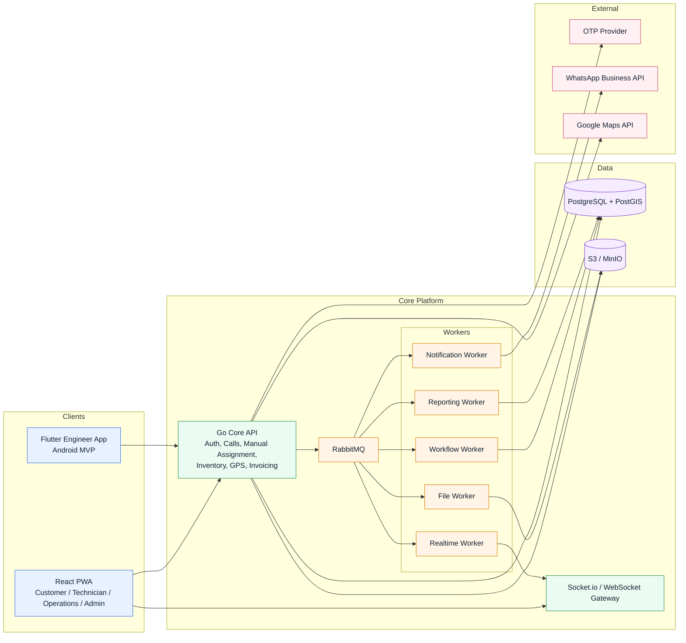
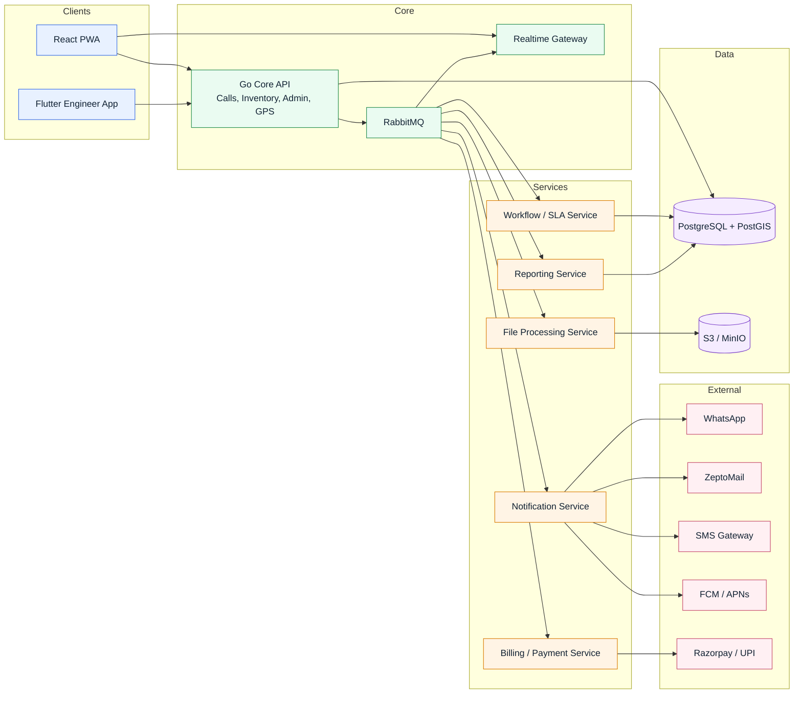
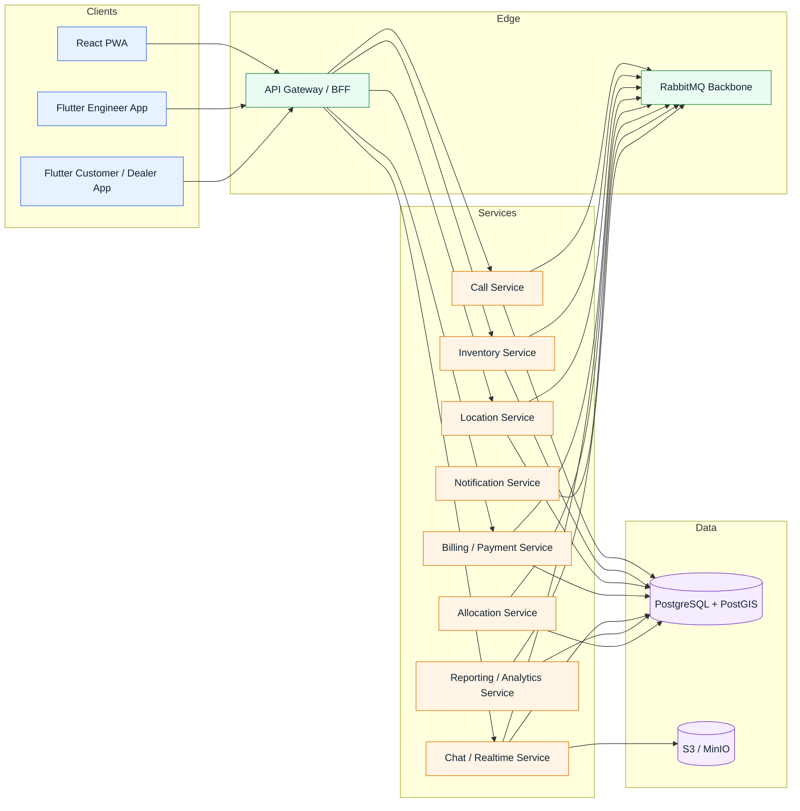

# Aithertech ServiceOps

> A phased architecture overview for a service management platform that supports customer booking, technician operations, inventory tracking, billing, notifications, and realtime field execution.

## Table of Contents

- [Overview](#overview)
- [Architecture Approach](#architecture-approach)
- [Phase 1-2 Architecture](#phase-1-2-architecture)
- [Phase 3-4 Architecture](#phase-3-4-architecture)
- [Phase 5 Architecture](#phase-5-architecture)
- [RabbitMQ Messaging Contract](#rabbitmq-messaging-contract)
- [Technology Stack](#technology-stack)
- [Phased Delivery Summary](#phased-delivery-summary)
- [Architecture Narrative](#architecture-narrative)

## Overview

Aithertech ServiceOps is a unified platform for managing the full electronics repair lifecycle: call registration, verification, assignment, field execution, parts handling, invoicing, notifications, reporting, and later payments, allocation, and chat.

The architecture is intentionally phased. It starts with a simple and operationally safe design centered on one Go Core API, PostgreSQL with PostGIS, RabbitMQ for backend async communication, and S3-compatible storage. As the platform grows, selected capabilities are extracted into dedicated services without forcing a full microservices architecture on day one.

## Architecture Approach

The recommended starting point is a modular monolith plus async workers.

- `Modular monolith` means one primary backend application with clear internal modules such as auth, service calls, inventory, GPS, invoicing, and admin configuration.
- `Async workers` means background processes consume RabbitMQ messages for work that does not need to block the user, such as notifications, file processing, report projections, and workflow timers.
- `RabbitMQ` is the communication layer between backend services and workers. It is used for events and async commands, not for user-facing CRUD request-response flows.
- This approach keeps the core transactional workflows simple in Phase 1 while creating clean expansion points for payments, omnichannel notifications, auto-assignment, and chat in later phases.

## Phase 1-2 Architecture

Phase 1-2 focuses on the operational core: customer and technician workflows, manual assignment, inventory, GPS tracking, invoice generation, basic notifications, reporting projections, and dealer and billing extensions.

Key characteristics of this phase:

- One `Go Core API` owns synchronous business workflows and the primary write path.
- `RabbitMQ` decouples notifications, file processing, reporting projections, and workflow automation from the user-facing API.
- `PostgreSQL + PostGIS` supports both operational data and geospatial queries for technician location and later allocation logic.
- `S3-compatible storage` stores photos and generated files such as invoice PDFs.

## Phase 3-4 Architecture

Phase 3-4 extends the platform with payments, omnichannel notifications, billing workflows, stronger alerting, and analytics. This is the first stage where specific capabilities are split into more service-shaped runtime boundaries.

Key characteristics of this phase:

- `Notification Service` expands from WhatsApp-only to WhatsApp, email, SMS, and push.
- `Billing / Payment Service` owns payment integration, reconciliation, and payout-related workflows.
- `Workflow / SLA Service` becomes the home for escalation rules, non-response alerts, and operational timers.
- The `Go Core API` still owns the main operational write path to avoid unnecessary fragmentation.

## Phase 5 Architecture

Phase 5 adds the allocation engine, in-app chat, richer mobile applications, and the broader shift toward a more service-based backend architecture.

Key characteristics of this phase:

- `Allocation Service` consumes location, skill, rating, and workload signals to support automated assignment and reassignment.
- `Chat / Realtime Service` supports in-app messaging across web and mobile clients with persisted messages and attachments.
- `API Gateway / BFF` gives clients a stable access layer while backend capabilities evolve into clearer service boundaries.
- Service extraction is driven by business capability and operational ownership, not by technical fashion.

## RabbitMQ Messaging Contract

RabbitMQ is the backend communication layer between workers and services. It is not the primary request-response transport for clients. User-facing CRUD requests continue to go through HTTP and WebSocket endpoints.

The diagrams above intentionally show RabbitMQ as a single platform component for readability. The exact queues and their responsibilities are documented in the tables below.

### Exchanges

- `serviceops.events`
  - Domain events emitted after successful business actions.
  - Examples: `call.created`, `call.assigned`, `call.status.changed`, `invoice.generated`, `payment.received`
- `serviceops.commands`
  - Targeted asynchronous work requests.
  - Examples: `send.notification`, `generate.invoice`, `process.image`, `run.auto_assignment`
- `serviceops.retry`
  - Delayed or scheduled retries for transient failures.
- `serviceops.dlq`
  - Dead-letter handling for messages that exceed retry limits and need operator review or replay.

### Initial Queues

| Queue | Function |
|-------|----------|
| `notifications.whatsapp` | Processes MVP WhatsApp notifications such as call registration, engineer assignment, and job closure messages. |
| `realtime.updates` | Fans out status changes and operational updates to connected web and mobile clients through Socket.io/WebSocket. |
| `files.process` | Handles asynchronous image compression, resizing, and file post-processing before or after S3 storage. |
| `workflow.alerts` | Runs SLA timers, overdue checks, non-response alerts, and other operational background workflow triggers. |
| `reporting.projections` | Builds reporting-ready projections, summary tables, or materialized-view refresh triggers from operational events. |

### Later Queues

| Queue | Function |
|-------|----------|
| `notifications.email` | Sends email notifications for status changes, invoices, receipts, and alert workflows. |
| `notifications.sms` | Sends critical SMS alerts where faster or fallback delivery is needed. |
| `notifications.push` | Sends push notifications to Flutter mobile apps using FCM and APNs. |
| `billing.payments` | Processes payment events, reconciliation tasks, payout triggers, and payment provider callbacks. |
| `allocation.run` | Executes auto-assignment and auto-reassignment workflows using skills, proximity, ratings, and workload signals. |
| `chat.events` | Processes chat-related async events such as delivery fan-out, attachment handling, and notification triggers. |

### Event Envelope

Every published event should follow a consistent envelope:

- `event_id`
- `event_type`
- `aggregate_id`
- `occurred_at`
- `actor_id`
- `correlation_id`
- `version`
- `payload`

### Delivery Principles

- Use `RabbitMQ` for backend-to-backend asynchronous communication.
- Keep core business write ownership centralized at the beginning, then extract services gradually.
- Make consumers `idempotent` so retries do not duplicate business actions.
- Use retries and dead-letter queues for resilience.
- Prefer a `transactional outbox` pattern when the Core API writes to PostgreSQL and publishes events.

## Technology Stack

### Frontend

- `React 18`, `TypeScript`, `Vite`
- `TanStack Query`, `Zustand`
- `Socket.io-client` for realtime updates
- `Tailwind CSS`
- `React Hook Form + Zod`
- `Workbox` for PWA offline support and caching

### Mobile

- `Flutter` for engineer and customer/dealer apps
- Android-first rollout in Phase 1 for engineer GPS tracking
- Full Android and iOS native app delivery in Phase 5

### Backend

- `Go` as the primary backend language
- `Gin` or `Echo` framework for REST APIs
- `JWT` access and refresh token authentication
- `Socket.io / WebSocket` for realtime status updates and later chat
- `RabbitMQ` for asynchronous processing and inter-service communication

### Data and Storage

- `PostgreSQL 14+` for transactional data
- `PostGIS` for geospatial queries, technician tracking, and allocation filters
- `S3-compatible storage` using `MinIO` or `AWS S3`
- `PostgreSQL materialized views + in-process cache` for reporting and hot reads

### External Integrations

- `OTP provider` for phone-based registration and password reset
- `WhatsApp Business API` for MVP and advanced notifications
- `ZeptoMail` for email notifications
- `SMS gateway` for critical alerts
- `Google Maps API` for geocoding, directions, and map views
- `Razorpay / UPI` for payment collection and payouts
- `FCM / APNs` for push notifications

## Phased Delivery Summary

| Phase | Primary Focus | Architecture Shape |
|-------|---------------|--------------------|
| `Phase 1-2` | Core platform, manual assignment, inventory, GPS, basic notifications, billing foundations, reporting | `Go Core API + RabbitMQ workers + PostgreSQL/PostGIS + S3` |
| `Phase 3-4` | Payments, omnichannel notifications, SLA workflows, analytics, operational enhancements | `Core API + extracted notification and billing-oriented services` |
| `Phase 5+` | Allocation engine, chat, richer mobile apps, broader backend decomposition | `Service-based architecture with RabbitMQ as the internal backbone` |

Recommended service extraction order:

1. `Notification Service`
2. `Billing / Payment Service`
3. `Allocation Service`
4. `Chat / Realtime Service`

## Architecture Narrative

The platform begins with one `Go Core API` because the most important Phase 1 requirement is reliable delivery of the operational workflow: authentication, service-call lifecycle management, manual assignment, inventory handling, GPS ingestion, and invoice generation. Keeping those synchronous writes in one backend makes transactions, audit trails, and release management much simpler during the MVP stage.

`RabbitMQ` is introduced from Phase 1 so that notifications, file processing, reporting projections, and workflow timers are already decoupled from the user-facing API. This creates clear async boundaries without forcing the team into early microservices complexity. The result is a system that stays simple where simplicity matters most, but is still ready to grow.

As the platform matures, capabilities that are naturally integration-heavy or operationally independent are extracted first. Notifications expands into a full omnichannel service, billing evolves into a payment-aware service, workflow logic grows into SLA automation and allocation support, and chat becomes its own realtime capability. This phased approach provides a low-risk starting point and a clean upgrade path toward a more service-based architecture.
